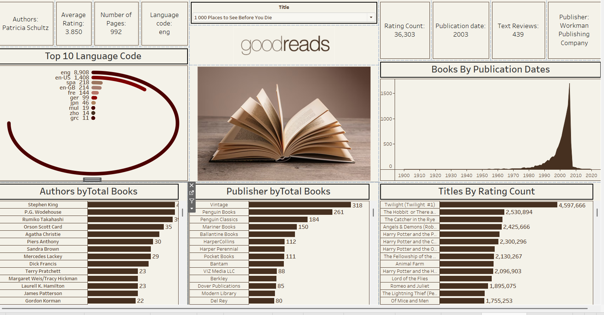

# Goodreads Books Analysis Dashboard

## Project Title
Goodreads Books Analysis using Power BI

## Brief Summary
Built an interactive Power BI dashboard to analyze Goodreads book data, uncovering insights on ratings, authors, publishers, languages, and publication trends.

## Overview
This project transforms Goodreads book dataset into an interactive dashboard for analyzing:
- Book ratings
- Authors
- Publishers
- Languages
- Publication trends
- Review metrics

The dashboard helps users explore book popularity and publishing patterns.

## Problem Statement
Book datasets contain rich information, but raw data is difficult to interpret without visualization.

This project answers:
- Which books have the highest ratings and review counts?
- Which authors published the most books?
- Which publishers dominate the dataset?
- What languages are most common?
- How have book publications changed over time?

## Dataset
Dataset includes:
- Book Title
- Authors
- Average Rating
- Language Code
- Number of Pages
- Publisher
- Publication Date
- Text Reviews Count
- Ratings Count

## Tool Used
- Power BI

## Dashboard Features
- KPI Cards
- Author analysis
- Publisher analysis
- Language distribution
- Publication trend analysis
- Ratings and reviews insights
- Interactive filters

## Key Insights
- English dominates book language distribution
- Certain authors contribute significantly more titles
- Vintage and Penguin Books are among top publishers
- Publication activity increased significantly after 1990

## Dashboard Preview

## Results & Conclusion
This project demonstrates how Power BI can convert Goodreads book data into interactive dashboards for literary trend analysis and business storytelling.

## Future Improvements
- Genre analysis
- Book recommendation insights
- Sentiment analysis of reviews

## Author
**Shushree Pranati Swain**

## 🔗 Connect with Me

👉 [LinkedIn Profile](https://www.linkedin.com/in/shushree-swain)
👉 [GitHub Profile](https://github.com/Shushree-Data-analyst)
